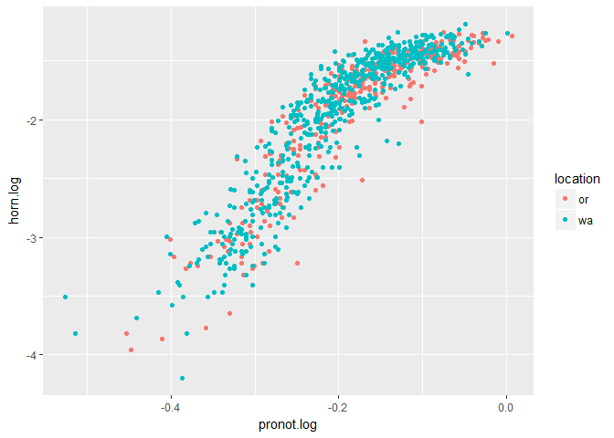
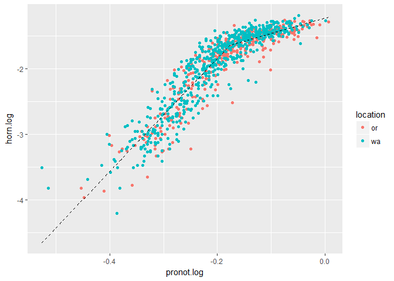
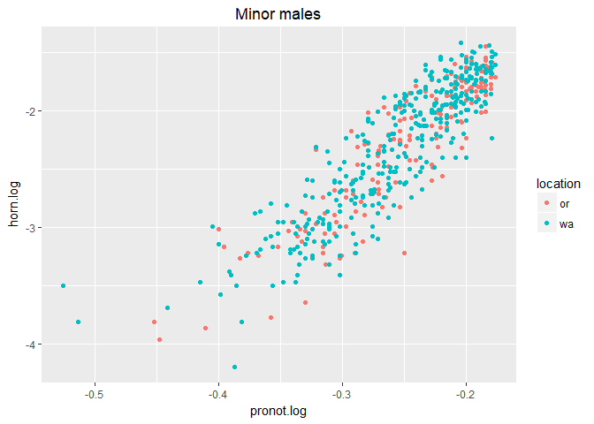
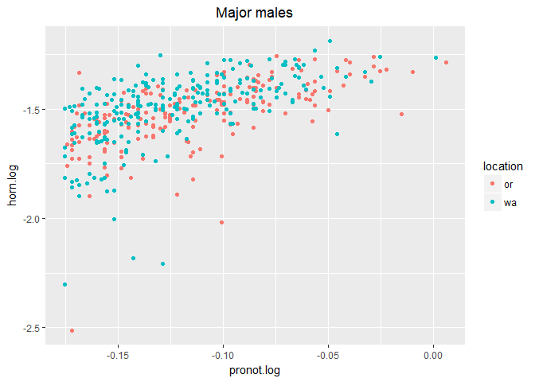
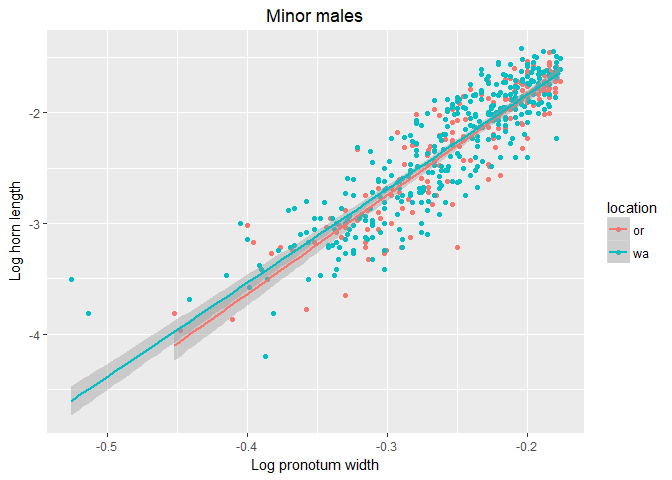
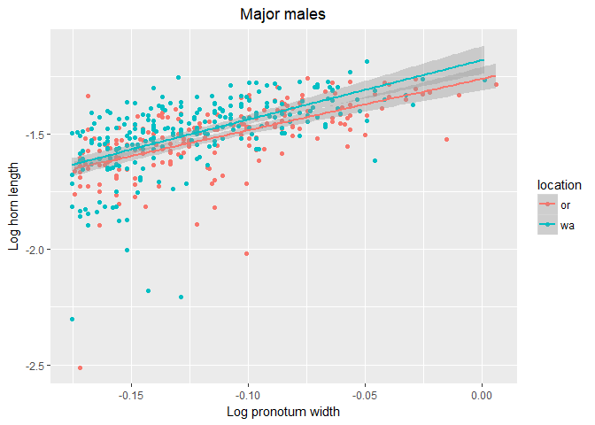

Evaluating Sigmoidal Allometry following Knell 2008
================
RAZ
March 1, 2018

Following the recommendations of Knell, 2008, I'm following his steps

Step 1, plot a log-log scatterplot of the data, and determine the type of relationship. Looking at the plot below, it's pretty clear there's a continuous relationship that isn't linear.

``` r
ggplot(dung, aes(x=pronot.log, y=horn.log, color=location))+
  geom_point()
```



Now, we fit some models to the data. He suggests a breakpoint model (i.e. using the `segmented` package), a quadratic model, and a simple linear model. I've done that below.

``` r
lin.mod<-lm(horn.log~pronot.log, data=dung)
break.mod<-segmented.lm(lin.mod, seg.Z = ~pronot.log, psi=(-0.3))
quad.mod<-lm(horn.log~poly(pronot.log,2), data=dung)
AIC(lin.mod,break.mod,quad.mod)
```

    ##           df        AIC
    ## lin.mod    3  116.91293
    ## break.mod  5 -251.41282
    ## quad.mod   4  -93.73653

The AIC indicates the best fitting model is the breakpoint model. Great! This is very useful for us, as we can then follow his recommendation (specifically for the data presented in Moczek, 2002) where he states "the simplest option in many cases will be to treat the two parts of the curve separately."

This is a cool idea, and easy to do!...but first let's plot the fitted data

``` r
break.fit<-fitted(break.mod)
fitted.data<-data.frame(LogPrthx=dung$pronot.log, HornFit=break.fit)
ggplot(dung, aes(x=pronot.log, y=horn.log))+
  geom_point(aes(color=location))+
  geom_line(data=fitted.data, aes(x=LogPrthx, y=HornFit), lty=2)
```



Looks sweet, right? How about we split the data, as Knell suggests, based on that breakpoint? We can get that pretty easily using `break.mod$psi`

``` r
break.mod$psi
```

    ##                 Initial       Est.      St.Err
    ## psi1.pronot.log    -0.3 -0.1765286 0.003793924

Sweet. Looks like the breakpoint is -0.1765592. Let's break the data into two subsets, one with everything with a pronot.log value below that, and one with a pronot.log value above that.

``` r
low.dung<- subset(dung, pronot.log<(-0.1765592))
high.dung<-subset(dung, pronot.log>(-0.1765592))
```

Let's plot each one to make sure



One thing that jumps out is that suddenly these look a LOT like linear relationships! Let's test that hypothesis! I'm going to fit both a linear and a quadratic model to both minor and major males, and see what happens.

``` r
minor.lin.mod<-lm(horn.log~pronot.log, data=low.dung)
minor.quad.mod<-lm(horn.log~poly(pronot.log,2), data=low.dung)
AIC(minor.lin.mod,minor.quad.mod)
```

    ##                df      AIC
    ## minor.lin.mod   3 89.87134
    ## minor.quad.mod  4 61.94759

``` r
major.lin.mod<-lm(horn.log~pronot.log, data=high.dung)
major.quad.mod<-lm(horn.log~poly(pronot.log,2), data=high.dung)
AIC(major.lin.mod,major.quad.mod)
```

    ##                df       AIC
    ## major.lin.mod   3 -559.3761
    ## major.quad.mod  4 -567.9911

Hmm. Well, in both cases the quadratic model is a better fit. For minor males it's a substantially better fit, but for major males it's only a slightly better fit. Interesting. I'm at the point where I think I can pretty easily check for differences between the two morphs in each location (Oregon vs Washington) with my standard methods (also suggested by Knell, when he mentions "Models were fitted with and without an interaction term between morph and log elytron length, to allow a test of whether the different morphs vary in the slope of the relationship or just in the intercept.")

``` r
summary(lm(data=low.dung, formula=horn.log~location/poly(pronot.log,2)-1))
```

    ## 
    ## Call:
    ## lm(formula = horn.log ~ location/poly(pronot.log, 2) - 1, data = low.dung)
    ## 
    ## Residuals:
    ##     Min      1Q  Median      3Q     Max 
    ## -0.8997 -0.1537  0.0074  0.1572  0.6187 
    ## 
    ## Coefficients:
    ##                                 Estimate Std. Error  t value Pr(>|t|)    
    ## locationor                      -2.34573    0.01934 -121.267  < 2e-16 ***
    ## locationwa                      -2.30589    0.01368 -168.591  < 2e-16 ***
    ## locationor:poly(pronot.log, 2)1 11.92494    0.44896   26.561  < 2e-16 ***
    ## locationwa:poly(pronot.log, 2)1 11.58577    0.31412   36.883  < 2e-16 ***
    ## locationor:poly(pronot.log, 2)2  0.90388    0.49963    1.809    0.071 .  
    ## locationwa:poly(pronot.log, 2)2  1.60350    0.29945    5.355 1.29e-07 ***
    ## ---
    ## Signif. codes:  0 '***' 0.001 '**' 0.01 '*' 0.05 '.' 0.1 ' ' 1
    ## 
    ## Residual standard error: 0.2551 on 519 degrees of freedom
    ## Multiple R-squared:  0.9887, Adjusted R-squared:  0.9886 
    ## F-statistic:  7587 on 6 and 519 DF,  p-value: < 2.2e-16

``` r
summary(lm(data=low.dung, formula=horn.log~poly(pronot.log,2)*location))
```

    ## 
    ## Call:
    ## lm(formula = horn.log ~ poly(pronot.log, 2) * location, data = low.dung)
    ## 
    ## Residuals:
    ##     Min      1Q  Median      3Q     Max 
    ## -0.8997 -0.1537  0.0074  0.1572  0.6187 
    ## 
    ## Coefficients:
    ##                                 Estimate Std. Error  t value Pr(>|t|)    
    ## (Intercept)                     -2.34573    0.01934 -121.267   <2e-16 ***
    ## poly(pronot.log, 2)1            11.92494    0.44896   26.561   <2e-16 ***
    ## poly(pronot.log, 2)2             0.90388    0.49963    1.809   0.0710 .  
    ## locationwa                       0.03983    0.02369    1.681   0.0933 .  
    ## poly(pronot.log, 2)1:locationwa -0.33917    0.54794   -0.619   0.5362    
    ## poly(pronot.log, 2)2:locationwa  0.69962    0.58250    1.201   0.2303    
    ## ---
    ## Signif. codes:  0 '***' 0.001 '**' 0.01 '*' 0.05 '.' 0.1 ' ' 1
    ## 
    ## Residual standard error: 0.2551 on 519 degrees of freedom
    ## Multiple R-squared:  0.803,  Adjusted R-squared:  0.8011 
    ## F-statistic: 423.1 on 5 and 519 DF,  p-value: < 2.2e-16

Something interesting comes out here. It looks like not only does the quadratic term not significantly affect the model, which means we can probably drop it out, but also that there's no difference in the allometry between Washington and Oregon for minor males. Let's drop it down and see what happens.

``` r
minor.model1<-lm(data=low.dung, formula=horn.log~poly(pronot.log,2)+location)
minor.model2<-lm(data=low.dung, formula=horn.log~pronot.log+location)
anova(minor.model1,minor.model2)
```

    ## Analysis of Variance Table
    ## 
    ## Model 1: horn.log ~ poly(pronot.log, 2) + location
    ## Model 2: horn.log ~ pronot.log + location
    ##   Res.Df    RSS Df Sum of Sq      F    Pr(>F)    
    ## 1    521 33.878                                  
    ## 2    522 35.927 -1   -2.0488 31.507 3.234e-08 ***
    ## ---
    ## Signif. codes:  0 '***' 0.001 '**' 0.01 '*' 0.05 '.' 0.1 ' ' 1

Hmm. Guess we need to keep it in. Either way, the same result stands, that there's not a significant effect of location on horn size for minor males. Let's look at majors.

``` r
summary(lm(data=high.dung, formula=horn.log~location/poly(pronot.log,2)-1))
```

    ## 
    ## Call:
    ## lm(formula = horn.log ~ location/poly(pronot.log, 2) - 1, data = high.dung)
    ## 
    ## Residuals:
    ##      Min       1Q   Median       3Q      Max 
    ## -0.84960 -0.04655  0.01401  0.07609  0.31700 
    ## 
    ## Coefficients:
    ##                                  Estimate Std. Error  t value Pr(>|t|)    
    ## locationor                      -1.526798   0.008894 -171.661   <2e-16 ***
    ## locationwa                      -1.489209   0.008147 -182.800   <2e-16 ***
    ## locationor:poly(pronot.log, 2)1  1.829846   0.180015   10.165   <2e-16 ***
    ## locationwa:poly(pronot.log, 2)1  1.974831   0.183409   10.767   <2e-16 ***
    ## locationor:poly(pronot.log, 2)2 -0.240052   0.172571   -1.391   0.1649    
    ## locationwa:poly(pronot.log, 2)2 -0.576802   0.189712   -3.040   0.0025 ** 
    ## ---
    ## Signif. codes:  0 '***' 0.001 '**' 0.01 '*' 0.05 '.' 0.1 ' ' 1
    ## 
    ## Residual standard error: 0.1258 on 439 degrees of freedom
    ## Multiple R-squared:  0.9932, Adjusted R-squared:  0.9931 
    ## F-statistic: 1.067e+04 on 6 and 439 DF,  p-value: < 2.2e-16

``` r
summary(lm(data=high.dung, formula=horn.log~poly(pronot.log,2)*location))
```

    ## 
    ## Call:
    ## lm(formula = horn.log ~ poly(pronot.log, 2) * location, data = high.dung)
    ## 
    ## Residuals:
    ##      Min       1Q   Median       3Q      Max 
    ## -0.84960 -0.04655  0.01401  0.07609  0.31700 
    ## 
    ## Coefficients:
    ##                                  Estimate Std. Error  t value Pr(>|t|)    
    ## (Intercept)                     -1.526798   0.008894 -171.661  < 2e-16 ***
    ## poly(pronot.log, 2)1             1.829846   0.180015   10.165  < 2e-16 ***
    ## poly(pronot.log, 2)2            -0.240052   0.172571   -1.391  0.16492    
    ## locationwa                       0.037589   0.012061    3.116  0.00195 ** 
    ## poly(pronot.log, 2)1:locationwa  0.144985   0.256991    0.564  0.57293    
    ## poly(pronot.log, 2)2:locationwa -0.336749   0.256459   -1.313  0.18984    
    ## ---
    ## Signif. codes:  0 '***' 0.001 '**' 0.01 '*' 0.05 '.' 0.1 ' ' 1
    ## 
    ## Residual standard error: 0.1258 on 439 degrees of freedom
    ## Multiple R-squared:  0.3601, Adjusted R-squared:  0.3528 
    ## F-statistic:  49.4 on 5 and 439 DF,  p-value: < 2.2e-16

Oh man, look! Location is different! So let's interpret this.

The first set of outputs isn't that exciting, but what you want is the second set of outputs. So, from top to bottom you have the intercept of the model (not interesting), and then you have the slope of the first part of the curve for Oregon beetles (so, 1.8), and then the change in slope (-0.2) for the second part of the curve. Then you have the change in slope for the Washington beetles compared to Oregon (0.03), and then the description of how that relationship changes. note that the second-order terms aren't significant here, so I'm actually going to drop them out to make this easier to interpret, since the AIC scores are not super different, unlike the minor males.

``` r
summary(lm(data=high.dung, formula=horn.log~location/pronot.log-1))
```

    ## 
    ## Call:
    ## lm(formula = horn.log ~ location/pronot.log - 1, data = high.dung)
    ## 
    ## Residuals:
    ##      Min       1Q   Median       3Q      Max 
    ## -0.86941 -0.04914  0.01625  0.07533  0.30036 
    ## 
    ## Coefficients:
    ##                       Estimate Std. Error t value Pr(>|t|)    
    ## locationor            -1.26024    0.02720 -46.340   <2e-16 ***
    ## locationwa            -1.17922    0.02921 -40.365   <2e-16 ***
    ## locationor:pronot.log  2.23087    0.22380   9.968   <2e-16 ***
    ## locationwa:pronot.log  2.58412    0.22711  11.378   <2e-16 ***
    ## ---
    ## Signif. codes:  0 '***' 0.001 '**' 0.01 '*' 0.05 '.' 0.1 ' ' 1
    ## 
    ## Residual standard error: 0.1271 on 441 degrees of freedom
    ## Multiple R-squared:  0.993,  Adjusted R-squared:  0.993 
    ## F-statistic: 1.568e+04 on 4 and 441 DF,  p-value: < 2.2e-16

``` r
summary(lm(data=high.dung, formula=horn.log~pronot.log*location))
```

    ## 
    ## Call:
    ## lm(formula = horn.log ~ pronot.log * location, data = high.dung)
    ## 
    ## Residuals:
    ##      Min       1Q   Median       3Q      Max 
    ## -0.86941 -0.04914  0.01625  0.07533  0.30036 
    ## 
    ## Coefficients:
    ##                       Estimate Std. Error t value Pr(>|t|)    
    ## (Intercept)           -1.26024    0.02720 -46.340   <2e-16 ***
    ## pronot.log             2.23087    0.22380   9.968   <2e-16 ***
    ## locationwa             0.08102    0.03991   2.030    0.043 *  
    ## pronot.log:locationwa  0.35326    0.31885   1.108    0.269    
    ## ---
    ## Signif. codes:  0 '***' 0.001 '**' 0.01 '*' 0.05 '.' 0.1 ' ' 1
    ## 
    ## Residual standard error: 0.1271 on 441 degrees of freedom
    ## Multiple R-squared:  0.3438, Adjusted R-squared:  0.3393 
    ## F-statistic: 77.01 on 3 and 441 DF,  p-value: < 2.2e-16

Now this I like. Looking again at the first output to get the slopes of each line (WA=2.58, OR=2.23), you can actually see that for major males, but not minor males, the slopes are statistically different from one another, and that WA males have a slightly larger slope, thus they scale faster to body size than minor males.

This is super exciting! It kind of follows Bergmann's rule! Large males from Washington have larger weapons than large males from Oregon!

Let's plot these guys, with some lines and confidence intervals. I'm going to just cheat and pretend they are linear for minor and major males, because I'm not really sure how I feel about this quadratic stuff, and frankly I think I can justify it pretty well based on Knell's work to just treat them as linear.


