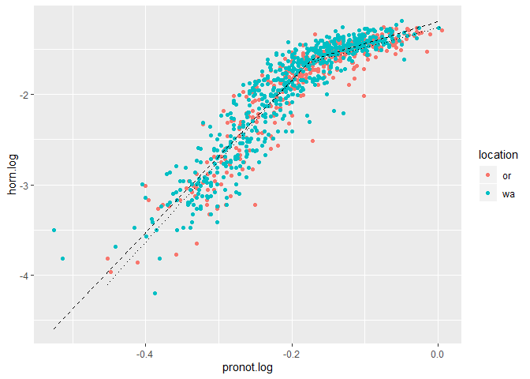

Evaluating Sigmoidal Allometry following Knell 2008, using split
breakpoints suggested by Kijimoto
================
RAZ
August 13, 2019

First I’m going to separate the data based on location (Oregon vs
Washington) and see how well the breakpoint model works for both of
them, and see if the breakpoints predicted by the model are similar.

``` r
dung.wa <- subset(dung, location=="wa")
dung.or <- subset(dung, location=="or")
```

I’m going to fit a model to each set of data

``` r
lin.mod.wa<-lm(horn.log~pronot.log, data=dung.wa)
break.mod.wa<-segmented.lm(lin.mod.wa, seg.Z = ~pronot.log, psi=(-0.3))
quad.mod.wa<-lm(horn.log~poly(pronot.log,2), data=dung.wa)
AIC(lin.mod.wa,break.mod.wa,quad.mod.wa)
```

    ##              df         AIC
    ## lin.mod.wa    3   68.480853
    ## break.mod.wa  5 -101.396900
    ## quad.mod.wa   4   -8.045497

``` r
lin.mod.or<-lm(horn.log~pronot.log, data=dung.or)
break.mod.or<-segmented.lm(lin.mod.or, seg.Z = ~pronot.log, psi=(-0.3))
quad.mod.or<-lm(horn.log~poly(pronot.log,2), data=dung.or)
AIC(lin.mod.or,break.mod.or,quad.mod.or)
```

    ##              df        AIC
    ## lin.mod.or    3   38.74488
    ## break.mod.or  5 -156.35210
    ## quad.mod.or   4 -106.29226

Hooray, for both models, the breakpoint analysis had the lowest AIC\!
Time to extract the breakponts for each model and see if they’re
different (going to have to eyeball them)

Let’s look at summary statistics for the
    models

``` r
print.segmented(break.mod.wa)
```

    ## Call: segmented.lm(obj = lin.mod.wa, seg.Z = ~pronot.log, psi = (-0.3))
    ## 
    ## Meaningful coefficients of the linear terms:
    ##   (Intercept)     pronot.log  U1.pronot.log  
    ##       -0.1564         8.4330        -5.9878  
    ## 
    ## Estimated Break-Point(s):
    ## psi1.pronot.log  
    ##         -0.1731

``` r
print.segmented(break.mod.or)
```

    ## Call: segmented.lm(obj = lin.mod.or, seg.Z = ~pronot.log, psi = (-0.3))
    ## 
    ## Meaningful coefficients of the linear terms:
    ##   (Intercept)     pronot.log  U1.pronot.log  
    ##       -0.0639         8.9258        -6.7098  
    ## 
    ## Estimated Break-Point(s):
    ## psi1.pronot.log  
    ##         -0.1785

Okay, so the breakpoints for these models are -0.173 for the Washington
data set and -0.178 for the Oregon data set. When I had them combined
the breakpoint was -0.176. I’m feeling pretty confident at this point
that my previous analysis works, and that there isn’t a separate
breakpoint for the two locations.

Let’s look at a plot- and remember, pay attention to where the two
dashed lines (the two fitted models) change slope. That’s the
breakpoint, and that’s what Kijimoto suggested we investigate for
differences.

``` r
break.fit.wa<-fitted(break.mod.wa)
fitted.data.wa<-data.frame(LogPrthx=dung.wa$pronot.log, HornFit=break.fit.wa)
break.fit.or<-fitted(break.mod.or)
fitted.data.or<-data.frame(LogPrthx=dung.or$pronot.log, HornFit=break.fit.or)


ggplot(dung, aes(x=pronot.log, y=horn.log))+
  geom_point(aes(color=location))+
  geom_line(data=fitted.data.wa, aes(x=LogPrthx, y=HornFit), lty=2)+
  geom_line(data=fitted.data.or, aes(x=LogPrthx, y=HornFit), lty=3)
```

<!-- -->

``` r
##How do I put a different legend for these lines? Worry about that later
```

The breakpoints seem visually very similar. You will note that the two
lines seem to diverge below and above this breakpoint, and you’re not
wrong\! If we go back to our previous analysis, those are the two lines
I compared, and found nothing different below the breakpoint, but a
location difference ABOVE the breakpoint. I feel validated, and I think
we can now consider the analysis “done”. I can make the graphs prettier,
combine them with the Slopes \~ latitude graph, and I can write up a
methods for it.
